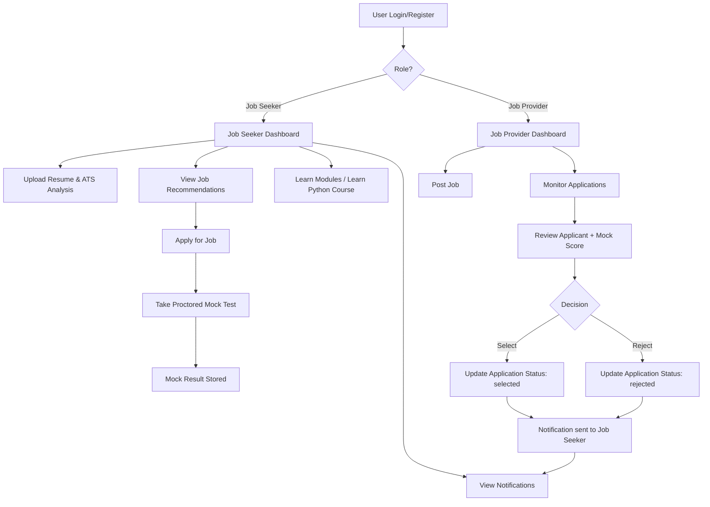

# SKILL LADDER

Skill Ladder is a full-stack career development platform for job seekers and job providers.
It includes resume analysis, job posting and applications, proctored mock tests, provider-side applicant decisions, notifications, and a structured learning system (including Learn Python course modules).

## Mentor and Team

- Mentor: **p.chinnasamy**
- Team Members:
  - **p.sasank satya pavan sai**
  - **N.Hemanth Reddy**
  - **M.Mahendra**
  - **K.Nagalinga**

## Project Structure

```text
SKILL-LADDER/
  project1/
    project1/
      backend/        # FastAPI APIs
      frontend/       # React app
      code-runner/    # Flask-based code/chat helper service
      README.md       # App-level notes
```

## Tech Stack

- Frontend: React.js
- Backend: FastAPI (Python)
- Extra service: Flask
- Database: Firebase Firestore (with local JSON/in-memory fallbacks in some flows)

## Prerequisites

- Python 3.10+ (or compatible with project dependencies)
- Node.js 18+ and npm
- Firebase credentials/config (if running with Firebase)

## Environment Setup

Create/update environment files:

- `project1/project1/project1/.env` (backend/front integration)
- `project1/python-compiler/python-compiler/.env` (if needed for compiler service)

Use your Firebase and app-specific values as required by backend/frontend config.

## Run the Project Locally

Open 3 terminals.

### 1) Start Backend (FastAPI)

```bash
cd "project1/project1/project1/backend"
python -m venv .venv
# Windows PowerShell:
.venv\Scripts\Activate.ps1
pip install -r requirements.txt
python -m uvicorn main:app --reload --host 0.0.0.0 --port 8001
```

### 2) Start Frontend (React)

```bash
cd "project1/project1/project1/frontend"
npm install
npm start
```

Frontend runs on:

- `http://localhost:3000`

### 3) Start Code Runner / Auxiliary Service (Flask)

```bash
cd "project1/project1/project1/code-runner"
python -m venv .venv
# Windows PowerShell:
.venv\Scripts\Activate.ps1
pip install -r requirements.txt
python app.py
```

## Main Workflow (Flowchart)



## Key Feature Flows

### Job Posting and Application Control

- Providers can post jobs with:
  - application limit
  - deadline
  - manual stop accepting option
- Applications automatically close when:
  - limit is reached, or
  - deadline passes, or
  - provider manually closes

### Mock Test + Provider Review

- Job seeker attempts proctored mock test.
- Result is saved and visible in provider monitor.
- Provider can select/reject candidates.
- Job seeker receives notification in Activities.

### Learn Python Course

- 10 module course with module-wise quiz
- Passing criteria: 60%
- Next module unlocks only after passing current module quiz
- Progress and score history tracked per user
- Certificate PDF generated after all modules are passed

## API Quick List (Backend)

- Job APIs: post job, apply job, job listing, application status updates
- Mock test APIs: submit and fetch mock test results
- Notification APIs: fetch seeker notifications
- Learn Python APIs:
  - `GET /learn-python/course`
  - `GET /learn-python/module/{module_id}`
  - `GET /learn-python/quiz/{module_id}`
  - `POST /learn-python/quiz/{module_id}/submit`
  - `GET /learn-python/progress`
  - `GET /learn-python/certificate`

## Troubleshooting

- If backend fails to start:
  - verify Python version
  - reinstall dependencies with `pip install -r requirements.txt`
- If frontend cannot reach backend:
  - ensure backend is running on port `8001`
  - verify CORS hosts in backend config
- If Firebase errors appear:
  - verify service account path and Firestore config
  - fallback/local flows may still allow partial functionality

## Upload to GitHub Repository

Repository URL:

- [https://github.com/Hemanthreddy5/SKILL-LADDER.git](https://github.com/Hemanthreddy5/SKILL-LADDER.git)

Run these commands from repository root after Git is installed:

```bash
git init
git add .
git commit -m "Add complete Skill Ladder project and comprehensive README"
git branch -M main
git remote add origin https://github.com/Hemanthreddy5/SKILL-LADDER.git
git push -u origin main
```

If remote already exists:

```bash
git remote set-url origin https://github.com/Hemanthreddy5/SKILL-LADDER.git
git push -u origin main
```

